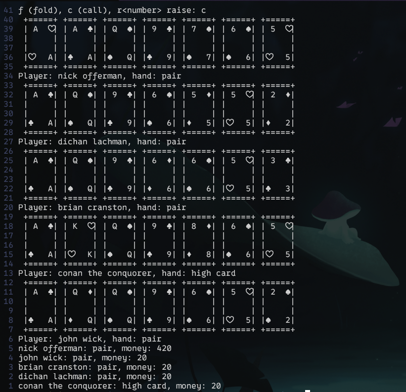

# A terminal based poker game
A fun poker game in the terminal - perfect for game nights

## Feature list
- Betting
- Rounds
- Card ascii art
- Adaptive padding in User interface
- Clean terminal UI
- Hand Evaluation
- Card engine

The hand evaluation ranks all of the hands, calculates tiebreakers, and lists, from best to worst, all players.

Tested with analysis of distributinos over 5 millio hands.
## TODO
- Split pots
- AI oponents
- Integrate TCP networking with asio
