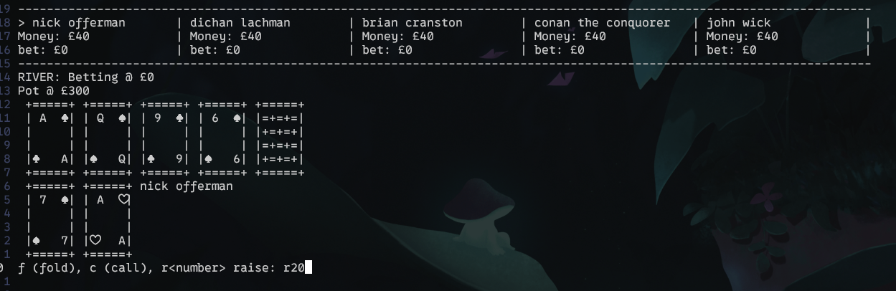
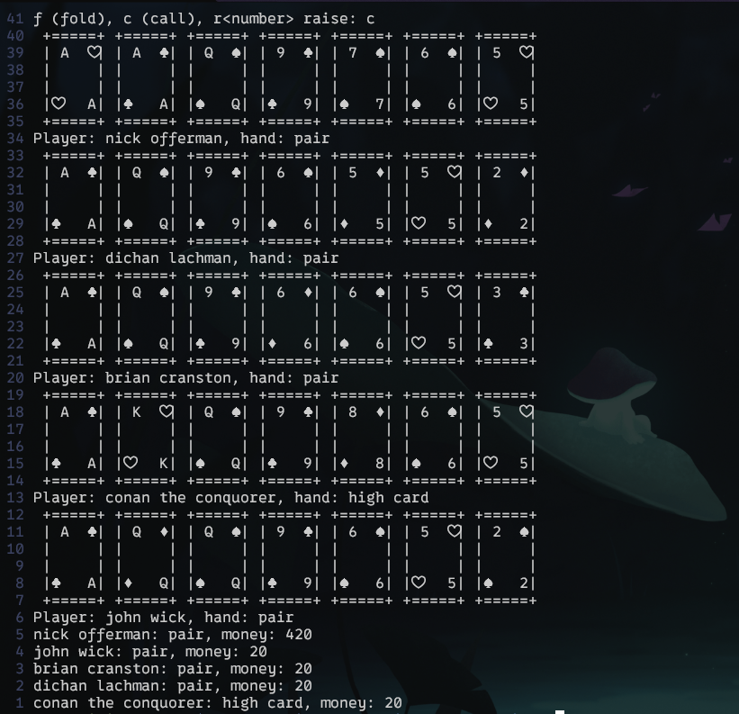

# A terminal based poker game
A fun poker game in the terminal - perfect for game nights

## Feature list
- Betting
- Rounds
- Card ascii art
- Adaptive padding in User interface
- Clean terminal UI
- Hand Evaluation
- Card engine

The hand evaluation ranks all players hands, calculates tiebreakers, and lists all players from best to worst.

## TODO
- Split pots
- AI oponents
- Integrate TCP networking with asio
